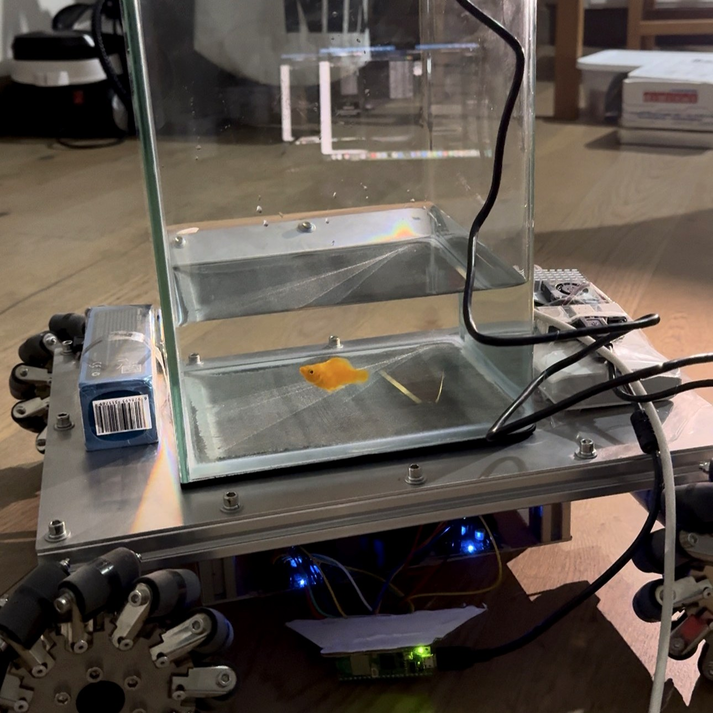
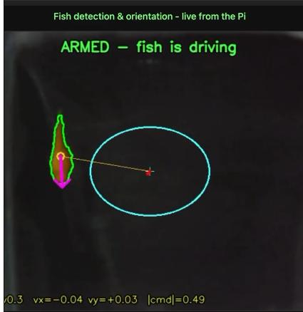
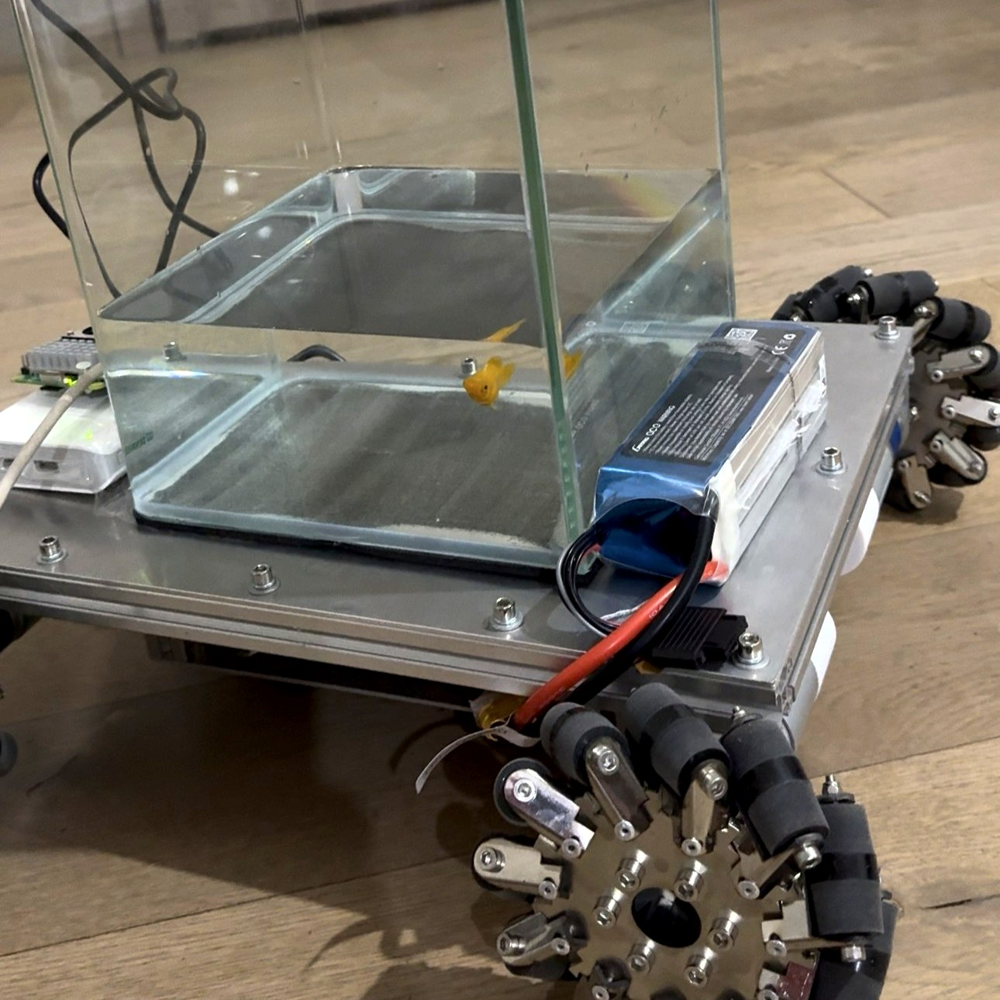

# Fish-Operated Vehicle

A goldfish drives a car.

<p align="center">
  
  
</p>

**[▶ Watch the demo on Instagram — 40,000+ views · 1,800+ likes in 72 hours](https://www.instagram.com/reel/DdIfr3PRKiI/)**

Built in under 24 hours by a team of two · September 2026

An overhead webcam watches a water tank mounted on a mecanum-wheel robot. The
fish is detected in real time on a Raspberry Pi 5, its heading is estimated
from its body shape, and drive commands are streamed to a Raspberry Pi Pico 2 W
that runs four DC motors through dual H-bridge drivers. Wherever the fish
points, the car goes.

```
                  overhead USB webcam
                          |
                  Raspberry Pi 5
        fish detection · control law · MJPEG HUD
                          |  USB serial
                  Raspberry Pi Pico 2 W
         mecanum mixing · PWM · failsafe watchdog
                          |  GPIO
          2x dual H-bridge drivers (opto-isolated)
                          |          \
                   4x mecanum wheels  24 V battery
```

## How it works

**Detection** (`fish_drive.py`) — the fish is segmented by color with two
independent tests ANDed together: an HSV orange gate and a LAB a-channel
"redness" floor. The combination survives dim lighting while rejecting tank
walls, shadows, and reflections, and a plausible-area window keeps large
false blobs from ever being selected. Works even when the fish holds still.

**Heading** — the fish's long axis comes from the second-order image moments
of its silhouette; which end is the head is decided by body taper (the head
end is wider than the tail). The heading is smoothed with an EMA.

**Control law** — two modes:

- `--mode heading` (default): the car drives in the direction the fish is
  facing. Speed is an integrator gated by swim effort: it builds while the
  fish actively swims along its facing and decays to a stop while it rests
  (`--speed accel`), or can instead be proportional to the fish's distance
  from the tank center (`--speed radial`).
- `--mode position`: the tank is a joystick. The fish's offset from center
  sets direction and speed, with a rest zone in the middle. A velocity
  feedforward term makes the car respond to swim bursts immediately.

**Motor firmware** (`pico/main.py`, MicroPython) — receives newline-delimited
velocity commands over USB serial, mixes them into four wheel duties
(mecanum kinematics), and drives the H-bridges with 20 kHz PWM. Includes
per-wheel direction inversion, asymmetric slew limiting (brisk acceleration,
gentle 1-second deceleration so the water doesn't slosh out of the tank), and
a 400 ms failsafe that stops the motors if the Pi goes quiet.

**Safety** — the car stays parked until the fish first swims into the center
zone; the operator terminal has a spacebar emergency stop and full manual
override on the keyboard at all times.

## Repository layout

```
fish_drive.py              main program: detection + control + HUD (runs on the Pi)
fish_detection_pi.py       standalone webcam detector with MJPEG stream
fish_detection.py          earlier RealSense D435i depth-based detector (macOS)
pico/
  main.py                  Pico 2 W firmware (MicroPython, auto-runs as main.py)
  drive.py                 keyboard drive console over SSH
  calibrate.py             per-wheel direction test
  calibrate_interactive.py guided wheel calibration, prints the INVERT config
  spin_test.py             single-motor bench test
  WIRING.md                complete pin map: Pico <-> drivers <-> motors <-> power
scripts/                   RealSense build/diagnostic helpers (macOS)
docs/                      hardware photos + live detection HUD capture
```

## Hardware

- Raspberry Pi 5 (Raspberry Pi OS, Python 3 + OpenCV + NumPy + pyserial)
- Raspberry Pi Pico 2 W (RP2350) running MicroPython 1.28
- USB webcam mounted above the tank
- 2x dual-channel 12 A MOSFET H-bridge drivers with opto-isolated inputs
- 4x DC gear motors with mecanum wheels, 24 V battery for the motor side
- Logic and motor grounds are kept separate; the drivers' isolation bridges them

Wiring details, the driver truth table, and the power-up checklist are in
[pico/WIRING.md](pico/WIRING.md).

<p align="center">
  
</p>

## Running it

Flash `pico/main.py` to the Pico (e.g. `mpremote fs cp pico/main.py :main.py`),
wire per `WIRING.md`, then on the Pi:

```bash
python3 fish_drive.py --dry-run    # HUD only, motors off — verify detection
python3 fish_drive.py              # fish drives for real
```

Watch the live HUD at `http://<pi-address>:8000`: fish outline, heading arrow,
command vector, and the armed/parked state.

Keyboard (in the SSH terminal while it runs): `SPACE` emergency stop, `WASD`
manual override, `Q/E/Z/C` diagonal corners, `J/L` rotate, `x` quit. The
standalone console `pico/drive.py` uses the same layout.

Useful flags: `--max-speed`, `--deadzone`, `--rest`, `--accel`, `--decay`,
`--hsv-lo/--hsv-hi/--min-a` (color gate), `--rot/--mirror` (camera mounting),
`--camera N` (defaults to auto-detection by stable USB id).

## Calibration

1. Wheels off the ground, then `python3 pico/calibrate_interactive.py` —
   it spins each wheel and asks which way it rolled, then prints the exact
   `INVERT = {...}` line for `pico/main.py`.
2. Drive with `python3 pico/drive.py` and confirm W is forward, A strafes
   left, Q/E corner correctly.
3. If the fish's commands come out mirrored or rotated relative to the car,
   fix it with `--rot 90/180/270` or `--mirror` instead of remounting the
   camera.

## Credits

Fish: unnamed, orange, surprisingly decisive.

The code in this repository was written with the help of Claude (Anthropic),
pair-programmed over one long hardware-debugging session that included USB
link-speed forensics, a stuck Wi-Fi radio, two brownouts, and one wedged
webcam.
